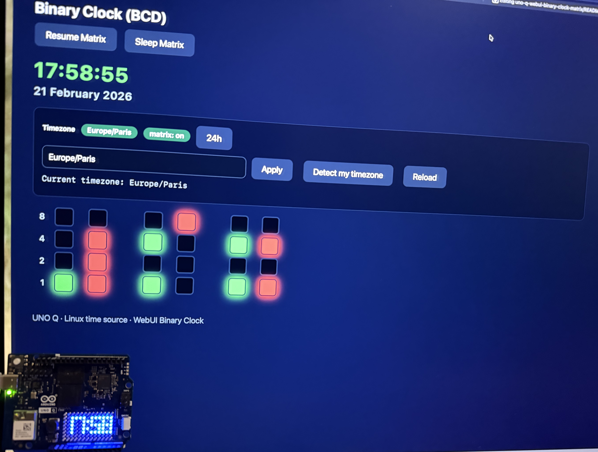

# UNO Q Binary Clock (WebUI + LED Matrix)

## Introduction

This project implements a complete binary clock application running on the Arduino UNO Q platform.  
It combines a web-based user interface, a Python service running on the Linux side of the board, and a   
microcontroller firmware controlling the LED matrix display.
The application allows users to:

- View the current time and date in real time
- Display the time using Binary Coded Decimal (BCD) representation in the WebUI
- Show the time on the built-in LED matrix using digital digits
- Select and apply different timezones
- Switch between 12-hour and 24-hour display modes
- Start or stop the LED matrix display remotely

The system uses the Linux operating system as the primary time source and control layer, while the STM32  
microcontroller acts exclusively as a hardware display controller. 

---

### Purpose of the Project

This application is designed as a pedagogical example demonstrating how different layers of an embedded  
system can interact in a modern hybrid architecture.

It illustrates :

- Interaction between a web interface and an embedded Linux system
- Use of REST APIs for real-time data exchange
- Communication between a Linux application and a microcontroller using RPC mechanisms
- Separation of responsibilities between system logic and hardware control

The project clearly shows how a single application can integrate:

- User interface management
- System-level processing
- Microcontroller-driven hardware rendering

---

## System Diagram

```
WebUI (Browser)  ⇄  REST API (HTTP/JSON)  ⇄  Linux (Python)  →  Bridge RPC  →  STM32  →  LED Matrix
```
---

### General System Behavior

In normal operation :

1. The WebUI periodically requests the current time from the Python application.
2. The Python application retrieves the system time and maintains the application state.
3. The Python application sends display updates to the STM32 microcontroller.
4. The STM32 renders the time on the LED matrix.

---

## Data Exchanges Between System Components

This application is built around a clear separation between three main components :

- The WebUI running in the browser
- The Python application running on the Linux side of the UNO Q
- The STM32 microcontroller controlling the LED matrix

The Python application acts as the central communication hub.

---

### 1. Communication Between WebUI and Linux (Python)

The WebUI and the Python application communicate using a REST API over HTTP.  

This communication is bidirectional.  

**Requests Sent From WebUI to Python**  
The browser sends commands and queries such as :

- Requesting the current time and date
- Changing the timezone
- Switching between 12h and 24h modes
- Starting or stopping the LED matrix display  

Examples of API calls:

```
GET  /api/time
POST /api/timezone
POST /api/hour_mode
POST /api/start
POST /api/stop
```

These requests are initiated by user actions or periodic polling.

---

**Responses Sent From Python to WebUI**  

The Python application responds with JSON data containing :

- Current time values (hour, minute, second)
- Current date values
- Timezone name
- Running/sleep state of the matrix
- Hour display mode (12h or 24h)

This allows the WebUI to update the display every second.

---

### 2. Communication Between Linux (Python) and STM32

Communication between the Linux side and the STM32 is performed using the **RouterBridge RPC   
mechanism.**

This communication is one-directional in this application.

---

**Commands Sent From Python to STM32**

The Python application sends only two types of commands :   

**Time Update Command**
Sent once per second when the matrix is running:

```
Bridge.call("updateTime", hour, minute, second)
```

This instructs the STM32 to :

---

**No Data Sent From STM32 to Python**

In this application, the STM32 does not send any information back to the Linux side.

It acts purely as a display controller.

---

### 3. Role of the Linux Side as the Communication Hub

All data exchanges pass through the Python application.  

It performs three key roles:  

- It receives user commands from the WebUI
- It computes and maintains the current time state
- It sends display instructions to the STM32


The STM32 never communicates directly with the WebUI.  

---

### 4. Summary of Data Flow Directions

**WebUI ↔ Linux (Python)**

Bidirectional communication :

- WebUI sends HTTP requests
- Python sends JSON responses

---

**Linux (Python) → STM32**

Unidirectional communication :  
- Python sends RPC commands
- STM32 executes display operations

---

**STM32 → Linux**

No data flow in this application.  

---

### 5. Key Architectural Principle

The system follows a strict hierarchy :

- The WebUI interacts only with the Linux side.
- The STM32 interacts only with the Linux side.

👉 The Python application is therefore the single point of coordination between user interface and hardware.


---

✨ Features
- Real-time clock synchronized with the Linux system time
- Timezone selection using standard IANA names (e.g., Europe/Paris)
- Automatic daylight saving time handling via the Linux timezone system
- Binary clock display in BCD format within the WebUI
- Digital time rendering on the LED matrix
- 12-hour / 24-hour display mode selection
- Remote start and stop control of the LED matrix
- Simple REST API communication between WebUI and Python
- Clear separation between system logic (Linux) and hardware display (STM32)
- Low complexity design, suitable for educational purposes

---

## 📁 Project Structure

```
/
├── docs
│   └── screenshot.jpg  
│
├── assets/
│   └── index.html      
│
├── python/
│   └── main.py        
│
├── sketch/
│   └── sketch.ino     
│   └── sketch.yaml
│ 
├── LICENSE
│
├── README.md
│
└── app.yaml
```
---

## Preview


---

## 🚀 How It Works

### Time Flow

The application operates in a simple cyclic process that repeats every second :
1. The Linux system retrieves the current time using its system clock.
2. The Python application updates its internal state and applies timezone conversion.
3. The Python application sends the current time to the STM32 using a Bridge RPC call :
  
```
Bridge.call("updateTime", hour, minute, second)
```

4. The STM32 firmware converts the digits into bitmap patterns and updates the LED matrix display.
5. In parallel, the WebUI periodically requests the current state from the Python application using the
   **/api/time** endpoint and updates the binary clock display.

**The Python application acts as the central coordinator between the WebUI and the microcontroller**.

---

## 🌐 Web API Endpoints

The Python application exposes a simple REST API used by the WebUI.  

---

Get Current Time
```
GET /api/time
```
Called by: the WebUI (automatically, every second)  
Purpose:  
To retrieve the current time, date, and application state so the browser can update the binary clock display.  
Example response :  

```
{
  "h": 14,
  "m": 32,
  "s": 10,
  "y": 2026,
  "mo": 2,
  "d": 21,
  "running": true,
  "timezone": "Europe/Paris",
  "hour_mode": 24
}

```


---

**Start LED matrix updates**

```
POST /api/start
```
Called by: the WebUI when the user clicks “Resume Matrix”   
Purpose:    
Sets the application to running mode so that the Python service resumes sending time updates to the STM32.    


---

**Stop LED matrix updates**

```
POST /api/stop
```

Called by: the WebUI when the user clicks “Sleep Matrix”  
Purpose:  
Stops display updates and instructs the STM32 to clear the LED matrix.  

---

Timezone Management  

Get current timezone  

```
GET /api/timezone
```

Called by: the WebUI during initialization and when refreshing the timezone panel.  
Purpose:  
Retrieves the currently active timezone configured on the Linux side.  

---

Set timezone  

```
POST /api/timezone?timezone=Europe/Paris
```

Called by: the WebUI when the user selects or detects a timezone.  
Purpose:  
Updates the active timezone and saves it in the local configuration file.  

---

Hour Display Mode  
Get hour mode  

```
GET /api/hour_mode
```
Called by: the WebUI at startup.  
Purpose:  
Determines whether the clock should display time in 12-hour or 24-hour format.  

---

Set hour mode  
```
POST /api/hour_mode?mode=12
```
Called by: the WebUI when the user toggles the hour format button.  
Purpose:  
Updates the display mode and stores the selection in the configuration file.  

---


## Access WebUI

```cpp
http://localhost:7000/
```
or

```cpp
http://UNOQ_IP:7000/
```


--- 

## License
MIT License.

---

## Acknowledgments

This project was developed with guidance and technical support from ChatGPT.
